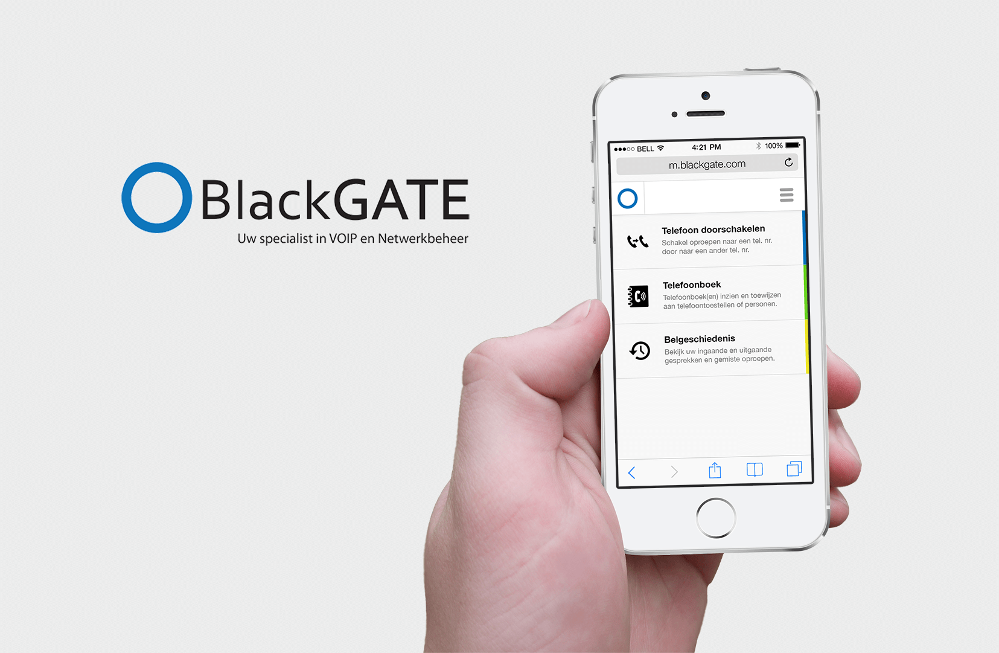
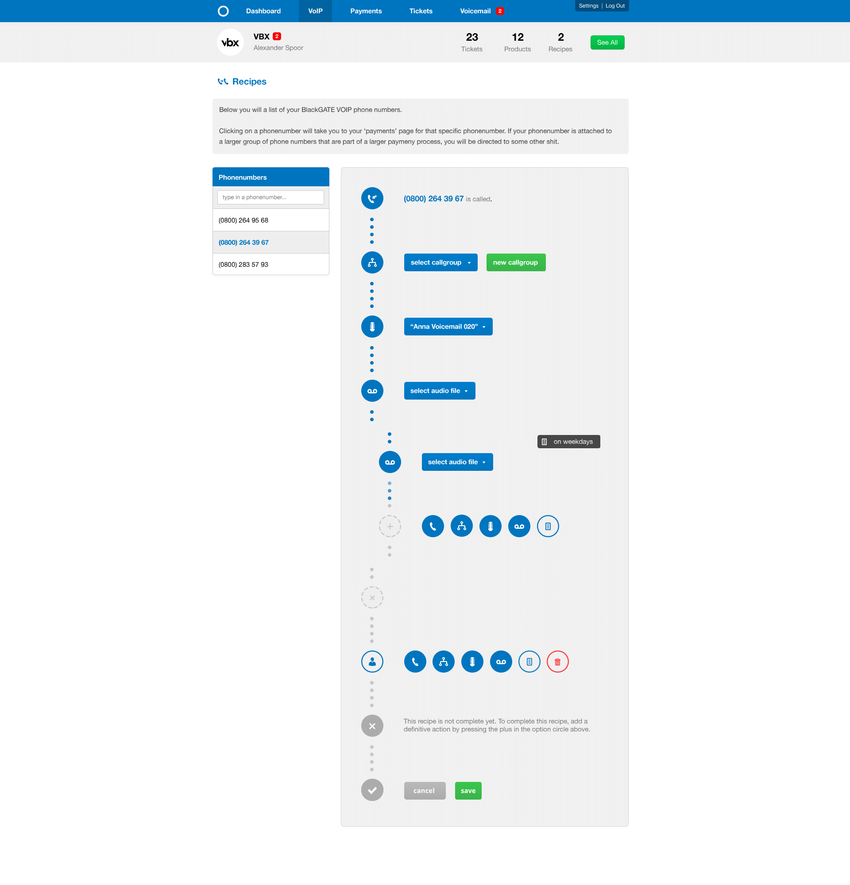

[BlackGATE][0] is a Telecom organisation specialised in VoIP and
networkservices.

## Challenge

VoIP software isn't somehing readily available. One of the software
implementations of [PBX][1] is called [Asterisk][2]. Its first release was in
1999 and although releases have been coming out steadily, it does not provide
a User Experience to rejoice.

This is why BlackGATE was looking for something better and more importantly
something that could be used by their customers, reducing the need for an
extensive helpdesk to set-up call forwarding or other complicated recipes.

## Solution

XP Bytes, in conjunction with the now defunct [Things Implied][3], designed and
developed a content management system, which the end users of [BlackGATE][0]
could use to accomplish various tasks such as:

- setting up the rules, triggered during the weekend or national holidays
- changing the forwarding number
- connecting new phones (devices)
- managing which public number calls which internal phones (devices)

We accomplished this by using JavaScript and a pragmatic design that quickly
gave an overview what happens if a call comes in. The data for the various
pop-ups and selection elements comes from the Rails API.

Additionally, the system can output the configuration in a format propiertary
to Asterisk and the other moving parts in the BlackGATE ecosystem. This means
that the technicians no longer needed to handcraft configuration files once a
new client comes onboard.

## Results

Due to the closure of [ThingsImplied][3] and miscalculation of the work-load,
the project was not finished by us in its entirety, but the system has been in
production for at least 5 year, is still being used and developed internally.

[0]: https://blackgate.nl
[1]: https://en.wikipedia.org/wiki/Business_telephone_system#Private_branch_exchange
[2]: https://www.asterisk.org/
[3]: https://thingsimplied.com
