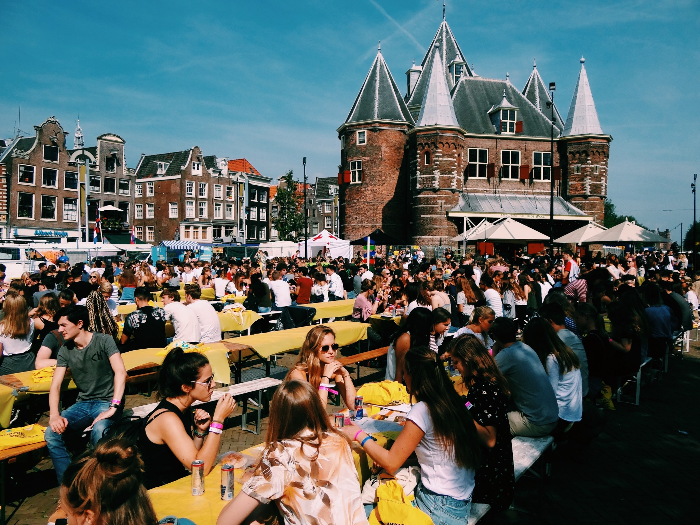

[Intreeweek][website-intreeweek] is the official introduction week of the
[University of Amsterdam][website-uva], where freshmen get to know the city,
the univercity and their fellow students, with two senior students of their
major as guides.

## Challenge

Intreeweek has been looking to become more digital and this started with adding
an companion app as a free resource for all attendees. The original challenge
was to digitilise the programme guide the students received as paperback, but
quickly grew to a true digital tool and later replacement of many things analog.

Over 3500 students can be concurrently active using the app; not everyone might
have a data plan; it needs to communicate important information such as
important news, changes in the programme and information about ongoing events.
Most of all, it has to be equal and greater than the analog variants it's
replacing.

## Solution

In order to make sure the application can be updated during the week adding new
functionality even last minute, XP Bytes chose to use [Expo][website-expo] -
The fastest way to build an app - allowing for over-the-air updatesm, a single
code base with a few special cases to deal with difference between Android and
iOS, whilst still having access to a cross-platform API to device capabilities
like camera, location and notifications.

Additionally, we worked together with [Tactile][website-tactile] who provide the
payment system for all events during the [Intreeweek][website-intreeweek]. As
years went by, the app grew to additionally provide a digital issue of their
daily newspaper ["De Gelegraaf"][website-gelegraaf], a personal account to see
and conctact members from the student's group, top-up their balance and get the
latest information.

A minimal [Node JS][website-nodejs] service using [express][website-express]
and [TypeScript][website-typescript] enables a small interactivity service which
is available when the device is online, falling back to a local cache for
everything else, allowing over 3000 devices concurrently to get the latest news
without impacting performance.

Push Broadcasts and Scheduled Local Notifications allowed the team to
communicate important information such a changes in the programme, where the
latter also tied in with their local business acquisition in a GDPR-friendly
manner.

Finally we built a WordPress plugin so that the committee could push newsitems,
built their digital paper and organise information in a manner they were already
used to.

## Results

The first year we ran this companion app, the usuage was about 50% of all
attendees, with good to extremely satisfied response. Currently we hit over
95%, meaning the committee has decided to completely stop printing the booklet
version of the programme or paper variants of the newspaper.

Additionally, the costs for the app, plus a substential part of the budget comes
from integration with partners via the acquisition programme that we provide.

[website-intreeweek]: https://intreeweek.nl/en/
[website-uva]: https://www.uva.nl/
[website-expo]: https://expo.io/
[website-tactile]: https://tactile.events/
[website-gelegraaf]: https://issuu.com/carmendorlo
[website-nodejs]: https://nodejs.org/
[website-express]: https://expressjs.com/
[website-typescript]: https://www.typescriptlang.org/
